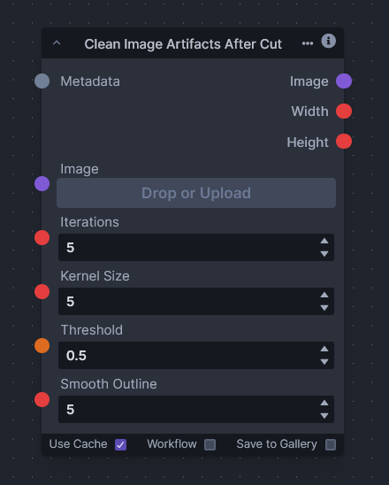

# Clean Image Artifacts After Cut

The "Clean Image Artifacts After Cut" node is designed to refine images that have been extracted from their backgrounds by removing unwanted artifacts. During the process of separating an image from its backdrop, it's common for sudden transitions, rough edges, or isolated pixels (artifacts) to disrupt the visual continuity of the image's outline. This node focuses on smoothing and clarifying the extracted image's edges to produce a cleaner, more visually appealing result.
